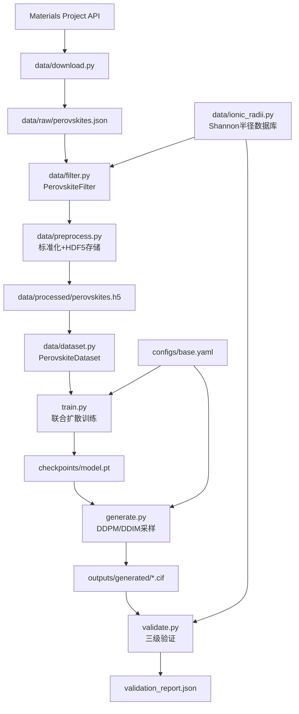

# 技术设计文档：ABO₃钙钛矿晶体结构扩散生成系统

## 概述

本系统基于扩散模型（DDPM/DDIM）生成有序氧化物ABO₃钙钛矿晶体结构。给定A/B位元素组合与目标属性（带隙、形成能），系统通过E(n)-等变图神经网络（EGNN）联合扩散晶格参数和分数坐标，生成化学合理的钙钛矿结构，并经三级验证链路筛选高质量候选结构。

核心设计决策：
- 晶格参数采用对数空间表示，确保生成的 a,b,c 始终为正
- 分数坐标使用 minimum-image convention 处理 PBC 边界
- 物理损失作用于预测的 x₀（非噪声 xₜ），提供更直接的结构约束
- Classifier-free guidance 实现属性条件生成
- 三级验证链路（几何→ML势→DFT）逐步筛选候选结构


## 1. 系统架构

### 1.1 模块化五层架构

```
┌─────────────────────────────────────────────────────────┐
│                     验证层 (validate.py)                  │
│         几何过滤 → ML势弛豫 → DFT确认（可选）              │
├─────────────────────────────────────────────────────────┤
│                     生成层 (generate.py)                  │
│         DDPM/DDIM采样 + Classifier-free Guidance         │
├─────────────────────────────────────────────────────────┤
│                     训练层 (train.py)                     │
│         联合扩散训练 + 物理损失 + 检查点管理               │
├─────────────────────────────────────────────────────────┤
│                     模型层 (models/)                      │
│    diffusion.py | egnn.py | physics_loss.py              │
├─────────────────────────────────────────────────────────┤
│                     数据层 (data/)                        │
│    ionic_radii.py | filter.py | preprocess.py | dataset.py│
└─────────────────────────────────────────────────────────┘
```

### 1.2 数据流图



### 1.3 技术栈

| 层次 | 技术 |
|------|------|
| 深度学习框架 | PyTorch 2.x |
| 晶体结构处理 | pymatgen |
| 数据存储 | HDF5 (h5py) |
| ML势能弛豫 | CHGNet / M3GNet |
| 实验跟踪 | WandB + TensorBoard |
| 配置管理 | YAML (PyYAML) |
| 测试框架 | pytest + hypothesis |
| 可视化 | matplotlib + plotly |


## 2. 数据管道设计 (data/)

### 2.1 离子半径数据库 (data/ionic_radii.py)

```python
class IonicRadiiDatabase:
    """Shannon离子半径查询接口"""
    
    def __init__(self):
        self._cache = {}
        self._default_oxidation_states = {
            'A_site': {'Ba': 2, 'Sr': 2, 'Ca': 2, 'Pb': 2, 'La': 3},
            'B_site': {'Ti': 4, 'Zr': 4, 'Nb': 5, 'Ta': 5, 'Fe': 3}
        }
    
    def get_radius(self, element: str, oxidation_state: int, 
                   coordination: int = 6) -> Optional[float]:
        """查询Shannon离子半径（单位：Å）"""
        
    def get_default_oxidation_state(self, element: str, site: str) -> int:
        """获取A/B位元素的默认氧化态"""
```

**设计决策**：
- 使用pymatgen.core.periodic_table.Species获取Shannon半径
- 缓存查询结果避免重复计算
- 对于缺失数据返回None并记录警告

### 2.2 数据筛选器 (data/filter.py)

```python
class PerovskiteFilter:
    """钙钛矿结构筛选器"""
    
    def filter_by_energy(self, structures: List[Dict], 
                        threshold: float = 0.1) -> List[Dict]:
        """能量过滤：energy_above_hull < threshold eV"""
        
    def filter_by_topology(self, structures: List[Dict]) -> List[Dict]:
        """拓扑过滤：验证corner-sharing BO₆八面体连通性"""
        
    def filter_by_coordination(self, structures: List[Dict]) -> List[Dict]:
        """配位数过滤：B-O配位数 = 6 ± 0.5"""
        
    def filter_by_oxidation_state(self, structures: List[Dict]) -> List[Dict]:
        """氧化态过滤：验证电中性约束"""
        
    def deduplicate(self, structures: List[Dict]) -> List[Dict]:
        """去重：使用pymatgen StructureMatcher"""
```

**关键算法**：
- **拓扑匹配**：检查B位原子是否被6个O原子配位，且BO₆八面体corner-sharing
- **配位数计算**：使用固定截断半径3.0Å或Voronoi分析
- **去重参数**：StructureMatcher(ltol=0.2, stol=0.3, angle_tol=5)

### 2.3 数据预处理 (data/preprocess.py)

```python
def preprocess_perovskites(raw_data_path: str, output_path: str, 
                          config: Dict) -> None:
    """
    预处理钙钛矿数据并保存为HDF5格式
    
    流程：
    1. 加载原始JSON数据
    2. 应用筛选器链
    3. 标准化为primitive cell
    4. 提取晶格参数和分数坐标
    5. Composition-aware split
    6. 保存到HDF5
    """
    
def composition_aware_split(structures: List[Dict], 
                           ratios: Tuple[float, float, float] = (0.8, 0.1, 0.1)
                           ) -> Tuple[List, List, List]:
    """
    按A-B元素组合分组，避免测试集泄漏
    
    算法：
    1. 按(A_element, B_element)分组
    2. 随机打乱组
    3. 按比例分配组到train/val/test
    """
```

**HDF5数据格式**：
```
perovskites.h5
├── train/
│   ├── frac_coords: (N, 5, 3) float32
│   ├── lattice_params: (N, 6) float32  # (a,b,c,α,β,γ)
│   ├── atom_types: (N, 5) int32  # 原子序数
│   ├── band_gap: (N,) float32
│   ├── formation_energy: (N,) float32
│   └── space_group: (N,) int32
├── val/
└── test/
```

### 2.4 PyTorch数据集 (data/dataset.py)

```python
class PerovskiteDataset(Dataset):
    """钙钛矿结构数据集"""
    
    def __init__(self, h5_path: str, split: str = 'train', 
                 augment: bool = True):
        self.h5_path = h5_path
        self.split = split
        self.augment = augment
        
    def __getitem__(self, idx: int) -> Dict[str, torch.Tensor]:
        """
        返回：
        {
            'frac_coords': (5, 3),
            'lattice_params': (6,),
            'atom_types': (5,),
            'band_gap': scalar,
            'formation_energy': scalar
        }
        """
        
    def augment_structure(self, coords: np.ndarray, 
                         lattice: np.ndarray) -> Tuple[np.ndarray, np.ndarray]:
        """数据增强：对称容许的小畸变（±0.02Å）"""
```


## 3. 模型层设计 (models/)

### 3.1 扩散调度器 (models/diffusion.py)

```python
class DiffusionSchedule:
    """扩散调度器，支持晶格对数空间和分数坐标PBC处理"""
    
    def __init__(self, T: int = 500, schedule_type: str = 'cosine'):
        self.T = T
        self.betas = self._get_beta_schedule(T, schedule_type)
        self.alphas = 1 - self.betas
        self.alpha_bar = torch.cumprod(self.alphas, dim=0)
        
    def lattice_to_log_space(self, lattice_params: torch.Tensor) -> torch.Tensor:
        """
        将晶格参数转换为对数空间
        输入: (B, 6) - (a, b, c, α, β, γ)
        输出: (B, 6) - (log a, log b, log c, α, β, γ)
        """
        log_params = lattice_params.clone()
        log_params[:, :3] = torch.log(lattice_params[:, :3])
        return log_params
        
    def log_space_to_lattice(self, log_params: torch.Tensor) -> torch.Tensor:
        """对数空间转回实空间"""
        lattice_params = log_params.clone()
        lattice_params[:, :3] = torch.exp(log_params[:, :3])
        return lattice_params
        
    def wrap_frac_coords(self, coords: torch.Tensor) -> torch.Tensor:
        """将分数坐标包裹到[0,1)区间"""
        return coords - torch.floor(coords)
        
    def add_noise(self, x0_lattice: torch.Tensor, x0_coords: torch.Tensor, 
                  t: torch.Tensor) -> Tuple[torch.Tensor, torch.Tensor, 
                                            torch.Tensor, torch.Tensor]:
        """
        联合加噪：晶格参数和分数坐标
        
        返回: (xt_lattice, xt_coords, noise_lattice, noise_coords)
        """
        # 晶格参数在对数空间加噪
        x0_log = self.lattice_to_log_space(x0_lattice)
        noise_lattice = torch.randn_like(x0_log)
        
        sqrt_alpha_bar_t = self.sqrt_alpha_bar[t].view(-1, 1)
        sqrt_one_minus_alpha_bar_t = self.sqrt_one_minus_alpha_bar[t].view(-1, 1)
        
        xt_log = sqrt_alpha_bar_t * x0_log + sqrt_one_minus_alpha_bar_t * noise_lattice
        
        # 分数坐标加噪后包裹
        noise_coords = torch.randn_like(x0_coords)
        xt_coords = sqrt_alpha_bar_t.view(-1, 1, 1) * x0_coords + \
                    sqrt_one_minus_alpha_bar_t.view(-1, 1, 1) * noise_coords
        xt_coords = self.wrap_frac_coords(xt_coords)
        
        return xt_log, xt_coords, noise_lattice, noise_coords
```

**设计决策**：
- 晶格长度在对数空间扩散，确保a,b,c始终为正
- 分数坐标加噪后用模运算包裹到[0,1)
- 支持V-prediction目标：v = α_t·ε - σ_t·x（可选）

### 3.2 改进EGNN架构 (models/egnn.py)

```python
class EGNNLayer(nn.Module):
    """E(n)-等变图神经网络层，支持PBC边构建"""
    
    def __init__(self, hidden_dim: int = 128, cutoff: float = 6.0):
        super().__init__()
        self.cutoff = cutoff
        
        # 边模型：计算消息
        self.edge_mlp = nn.Sequential(
            nn.Linear(hidden_dim * 2 + 1, hidden_dim),
            nn.SiLU(),
            nn.Linear(hidden_dim, hidden_dim)
        )
        
        # 注意力权重
        self.attention = nn.Sequential(
            nn.Linear(hidden_dim, 1),
            nn.Sigmoid()
        )
        
        # 节点更新
        self.node_mlp = nn.Sequential(
            nn.Linear(hidden_dim * 2, hidden_dim),
            nn.SiLU(),
            nn.Linear(hidden_dim, hidden_dim)
        )
        
        # 坐标更新（等变）
        self.coord_mlp = nn.Sequential(
            nn.Linear(hidden_dim, hidden_dim),
            nn.SiLU(),
            nn.Linear(hidden_dim, 1, bias=False)
        )
        
    def build_edges_pbc(self, frac_coords: torch.Tensor, 
                       lattice_matrix: torch.Tensor) -> Tuple[torch.Tensor, torch.Tensor]:
        """
        构建PBC-aware边
        
        使用minimum-image convention计算最短距离
        """
        
    def forward(self, h: torch.Tensor, x: torch.Tensor, 
               edge_index: torch.Tensor, edge_dist: torch.Tensor) -> Tuple:
        """
        h: (N, hidden_dim) 节点特征
        x: (N, 3) 笛卡尔坐标
        edge_index: (2, E) 边索引
        edge_dist: (E,) 边距离
        """
```


### 3.3 物理信息损失 (models/physics_loss.py)

```python
class PhysicsLoss:
    """精细物理约束损失函数"""
    
    def __init__(self, ionic_radii_db: IonicRadiiDatabase):
        self.radii_db = ionic_radii_db
        
    def goldschmidt_loss(self, structure: Structure, 
                        atom_types: torch.Tensor) -> torch.Tensor:
        """
        Goldschmidt容忍因子损失
        t = (r_A + r_O) / [√2(r_B + r_O)]
        有效范围：[0.8, 1.0]
        """
        
    def coordination_loss(self, coords: torch.Tensor, 
                         lattice: torch.Tensor,
                         atom_types: torch.Tensor) -> torch.Tensor:
        """BO₆配位数损失：惩罚B-O配位数偏离6"""
        
    def bond_length_loss(self, coords: torch.Tensor,
                        lattice: torch.Tensor,
                        atom_types: torch.Tensor) -> torch.Tensor:
        """
        键长分布损失
        - B-O键长：1.8-2.2Å
        - A-O键长：2.5-3.2Å
        """
        
    def bond_angle_loss(self, coords: torch.Tensor,
                       lattice: torch.Tensor,
                       atom_types: torch.Tensor) -> torch.Tensor:
        """
        O-B-O键角损失：惩罚偏离90°/180°
        """
        
    def bond_valence_sum_loss(self, structure: Structure) -> torch.Tensor:
        """键价和损失：验证氧化态合理性"""
        
    def pauli_repulsion_loss(self, coords: torch.Tensor,
                            lattice: torch.Tensor,
                            min_dist: float = 1.5) -> torch.Tensor:
        """Pauli排斥：惩罚原子间距 < min_dist"""
        
    def combined_loss(self, pred_x0_coords: torch.Tensor,
                     pred_x0_lattice: torch.Tensor,
                     atom_types: torch.Tensor,
                     weights: Dict[str, float]) -> torch.Tensor:
        """
        组合物理损失
        
        weights = {
            'goldschmidt': 1.0,
            'coordination': 0.5,
            'bond_length': 0.3,
            'bond_angle': 0.2,
            'bvs': 0.1,
            'pauli': 1.0
        }
        """
```

**设计决策**：
- 所有物理损失作用于预测的x₀（去噪后的结构），而非噪声xₜ
- 使用可配置权重平衡不同约束
- Goldschmidt因子和配位数为硬约束（高权重）


## 4. 训练框架设计 (train.py)

```python
class DiffusionTrainer:
    """扩散模型训练器"""
    
    def __init__(self, model: nn.Module, diffusion: DiffusionSchedule,
                 physics_loss: PhysicsLoss, config: Dict):
        self.model = model
        self.diffusion = diffusion
        self.physics_loss = physics_loss
        self.config = config
        
        # 优化器
        self.optimizer = torch.optim.AdamW(
            model.parameters(), 
            lr=config['lr'],
            weight_decay=config['weight_decay']
        )
        
        # 学习率调度
        self.scheduler = torch.optim.lr_scheduler.CosineAnnealingLR(
            self.optimizer, 
            T_max=config['epochs']
        )
        
    def train_step(self, batch: Dict) -> Dict[str, float]:
        """
        单步训练
        
        流程：
        1. 提取晶格参数和分数坐标
        2. 随机采样时间步t
        3. 联合加噪
        4. EGNN预测噪声
        5. 计算噪声预测损失
        6. 预测x₀并计算物理损失
        7. 反向传播
        """
        
    def predict_x0_from_noise(self, xt: torch.Tensor, 
                             noise_pred: torch.Tensor,
                             t: torch.Tensor) -> torch.Tensor:
        """从噪声预测反推x₀"""
        alpha_bar_t = self.diffusion.alpha_bar[t]
        x0_pred = (xt - torch.sqrt(1 - alpha_bar_t) * noise_pred) / torch.sqrt(alpha_bar_t)
        return x0_pred
```

**训练配置**：
- Batch size: 32
- Learning rate: 5e-5
- Optimizer: AdamW (weight_decay=0.01)
- Gradient clipping: max_norm=1.0
- Epochs: 500
- Validation frequency: 每10 epoch
- Checkpoint frequency: 每20 epoch
- Early stopping: patience=20


## 5. 生成模块设计 (generate.py)

```python
class PerovskiteGenerator:
    """钙钛矿结构生成器"""
    
    def __init__(self, model: nn.Module, diffusion: DiffusionSchedule, config: Dict):
        self.model = model
        self.diffusion = diffusion
        self.config = config
        
    @torch.no_grad()
    def generate(self, a_element: str, b_element: str,
                target_bandgap: float, target_formation_energy: float,
                num_samples: int = 10, guidance_scale: float = 3.0) -> List[Structure]:
        """
        条件生成钙钛矿结构
        
        流程：
        1. 初始化：从N(0,1)采样晶格和坐标
        2. 逆向扩散T步
        3. 每步应用classifier-free guidance
        4. 包裹分数坐标到[0,1)
        5. 转换为pymatgen Structure对象
        """
        
    def ddpm_sample_step(self, xt_lattice: torch.Tensor, xt_coords: torch.Tensor,
                        t: int, condition: Dict, guidance_scale: float) -> Tuple:
        """DDPM采样单步"""
        
    def ddim_sample_step(self, xt_lattice: torch.Tensor, xt_coords: torch.Tensor,
                        t: int, condition: Dict, eta: float = 0.0) -> Tuple:
        """DDIM采样单步（更快）"""
        
    def classifier_free_guidance(self, noise_pred_cond: torch.Tensor,
                                noise_pred_uncond: torch.Tensor,
                                guidance_scale: float) -> torch.Tensor:
        """
        无分类器引导
        noise_pred = noise_uncond + scale * (noise_cond - noise_uncond)
        """
```

**生成参数**：
- Sampling steps: 100 (DDPM) / 50 (DDIM)
- Guidance scale: 3.0
- Temperature: 1.0
- Eta (DDIM): 0.0 (deterministic)


## 6. 验证模块设计 (validate.py)

```python
class StructureValidator:
    """三级验证链路"""
    
    def __init__(self, ionic_radii_db: IonicRadiiDatabase, config: Dict):
        self.radii_db = ionic_radii_db
        self.config = config
        
    def level1_geometric_filter(self, structures: List[Structure]) -> Tuple[List[Structure], Dict]:
        """
        第一级：几何/化学快速过滤
        
        检查项：
        1. 原子间最小距离 > 1.5Å
        2. Goldschmidt容忍因子 ∈ [0.8, 1.0]
        3. B-O配位数 = 6 ± 0.5
        4. 键价和验证氧化态
        
        返回：(通过的结构, 统计报告)
        """
        
    def level2_ml_potential_relax(self, structures: List[Structure]) -> Tuple[List[Structure], Dict]:
        """
        第二级：ML势能弛豫
        
        使用CHGNet或M3GNet：
        1. 单点能计算
        2. 结构弛豫（可选）
        3. 估算energy_above_hull
        4. 过滤不稳定结构（E_hull > 0.2 eV）
        """
        
    def level3_dft_confirmation(self, structures: List[Structure], top_k: int = 10) -> Dict:
        """
        第三级：DFT确认（可选）
        
        对top-k候选结构：
        1. 生成VASP输入文件
        2. 提交DFT计算
        3. 解析结果
        4. Reranking
        """
```


## 7. 评测体系设计

```python
class GenerationMetrics:
    """生成质量评测指标"""
    
    def compute_validity_rate(self, structures: List[Structure]) -> float:
        """有效率：通过第一级验证的比例"""
        
    def compute_uniqueness(self, structures: List[Structure]) -> float:
        """唯一性：去重后的比例（使用StructureMatcher）"""
        
    def compute_novelty(self, generated: List[Structure], 
                       training_set: List[Structure]) -> float:
        """新颖性：与训练集不重复的比例"""
        
    def compute_property_mae(self, generated_props: Dict, 
                            target_props: Dict) -> Dict[str, float]:
        """属性MAE：带隙和形成能的预测误差"""
        
    def compute_coverage(self, generated_props: np.ndarray,
                        target_range: Tuple[float, float]) -> float:
        """覆盖率：属性空间覆盖百分比"""
        
    def compute_diversity(self, structures: List[Structure]) -> float:
        """多样性：成对结构距离的均值"""
        
    def compute_condition_satisfaction_rate(self, generated_props: Dict,
                                           target_props: Dict,
                                           tolerance: float = 0.3) -> float:
        """条件满足率：满足目标属性±tolerance的比例"""
```

**Baseline对比**：
- Random baseline：随机扰动训练集结构
- CDVAE baseline：使用CDVAE模型生成


## 8. 配置系统设计 (configs/)

### 8.1 配置文件结构 (configs/base.yaml)

```yaml
# 数据配置
data:
  raw_data_path: "data/raw/perovskites.json"
  processed_data_path: "data/processed/perovskites.h5"
  split_ratios: [0.8, 0.1, 0.1]
  batch_size: 32
  num_workers: 4
  augment: true

# 模型配置
model:
  hidden_dim: 128
  n_layers: 4
  cutoff_radius: 6.0
  use_attention: true

# 扩散配置
diffusion:
  timesteps: 500
  schedule_type: "cosine"
  prediction_type: "epsilon"  # or "v_prediction"

# 训练配置
training:
  epochs: 500
  lr: 5.0e-5
  weight_decay: 0.01
  grad_clip: 1.0
  val_frequency: 10
  checkpoint_frequency: 20
  early_stopping_patience: 20
  device: "cuda"

# 物理损失权重
physics_loss:
  goldschmidt: 1.0
  coordination: 0.5
  bond_length: 0.3
  bond_angle: 0.2
  bvs: 0.1
  pauli: 1.0

# 生成配置
generation:
  num_samples: 100
  sampling_steps: 100
  sampler: "ddpm"  # or "ddim"
  guidance_scale: 3.0
  temperature: 1.0

# 验证配置
validation:
  min_distance: 1.5
  goldschmidt_range: [0.8, 1.0]
  coordination_tolerance: 0.5
  use_ml_potential: true
  ml_potential_type: "chgnet"
  use_dft: false
  dft_top_k: 10
```


## 9. 正确性属性（Property-Based Testing）

### 9.1 EGNN等变性属性

```python
@given(coords=fractional_coordinates(), rotation=rotation_matrices())
def test_egnn_rotation_equivariance(coords, rotation):
    """
    属性：EGNN对旋转变换等变
    
    ∀ rotation R, EGNN(R·x) = R·EGNN(x)
    """
    
@given(coords=fractional_coordinates(), translation=translation_vectors())
def test_egnn_translation_invariance(coords, translation):
    """
    属性：EGNN对平移变换不变
    
    ∀ translation t, EGNN(x + t) = EGNN(x)
    """
```

### 9.2 扩散调度正确性

```python
@given(t=integers(min_value=0, max_value=499))
def test_alpha_bar_monotonic_decreasing(t):
    """
    属性：alpha_bar单调递减
    
    ∀ t, alpha_bar[t] > alpha_bar[t+1]
    """
    
def test_diffusion_boundary_conditions():
    """
    属性：边界条件
    
    - alpha_bar[0] ≈ 1.0
    - alpha_bar[T-1] ≈ 0.0
    """
```

### 9.3 晶格参数约束

```python
@given(log_lattice=floats(min_value=-2, max_value=3))
def test_lattice_always_positive(log_lattice):
    """
    属性：对数空间转换后晶格参数始终为正
    
    ∀ log_a, exp(log_a) > 0
    """
```

### 9.4 PBC距离正确性

```python
@given(frac_coords=fractional_coordinates(), lattice=lattice_matrices())
def test_minimum_image_distance(frac_coords, lattice):
    """
    属性：minimum-image距离 ≤ 直接距离
    
    ∀ coords, d_pbc(x, y) ≤ d_direct(x, y)
    """
```

### 9.5 Goldschmidt计算正确性

```python
@given(r_a=floats(min_value=1.0, max_value=2.0),
       r_b=floats(min_value=0.5, max_value=1.0),
       r_o=floats(min_value=1.3, max_value=1.5))
def test_goldschmidt_formula(r_a, r_b, r_o):
    """
    属性：Goldschmidt公式数值正确性
    
    t = (r_A + r_O) / [√2(r_B + r_O)]
    """
    t = (r_a + r_o) / (math.sqrt(2) * (r_b + r_o))
    assert 0 < t < 2  # 物理合理范围
```

## 10. 关键算法伪代码

### 10.1 PBC-aware边构建

```
function build_edges_pbc(frac_coords, lattice_matrix, cutoff):
    edges = []
    for i in range(N):
        for j in range(N):
            if i == j: continue
            
            # 考虑周期镜像
            min_dist = infinity
            for dx in [-1, 0, 1]:
                for dy in [-1, 0, 1]:
                    for dz in [-1, 0, 1]:
                        offset = [dx, dy, dz]
                        frac_j_image = frac_coords[j] + offset
                        cart_i = lattice_matrix @ frac_coords[i]
                        cart_j = lattice_matrix @ frac_j_image
                        dist = ||cart_i - cart_j||
                        min_dist = min(min_dist, dist)
            
            if min_dist < cutoff:
                edges.append((i, j, min_dist))
    
    return edges
```

### 10.2 联合扩散训练步骤

```
function train_step(batch):
    # 1. 提取数据
    x0_coords = batch['frac_coords']
    x0_lattice = batch['lattice_params']
    properties = batch['properties']
    
    # 2. 随机时间步
    t = random_int(0, T)
    
    # 3. 联合加噪
    xt_lattice, xt_coords, noise_lattice, noise_coords = diffusion.add_noise(
        x0_lattice, x0_coords, t
    )
    
    # 4. 模型预测
    noise_pred_lattice, noise_pred_coords = model(
        xt_lattice, xt_coords, t, properties
    )
    
    # 5. 噪声预测损失
    loss_noise = MSE(noise_pred_lattice, noise_lattice) + \
                 MSE(noise_pred_coords, noise_coords)
    
    # 6. 预测x0
    x0_pred_lattice = predict_x0(xt_lattice, noise_pred_lattice, t)
    x0_pred_coords = predict_x0(xt_coords, noise_pred_coords, t)
    
    # 7. 物理损失
    loss_physics = physics_loss.combined_loss(
        x0_pred_coords, x0_pred_lattice, batch['atom_types']
    )
    
    # 8. 总损失
    loss = loss_noise + 0.1 * loss_physics
    
    # 9. 反向传播
    loss.backward()
    clip_grad_norm(model.parameters(), max_norm=1.0)
    optimizer.step()
    
    return loss
```

---

## 总结

本设计文档详细描述了ABO₃钙钛矿扩散生成系统的技术架构、核心算法和接口设计。关键创新点包括：

1. **对数空间晶格表示**确保生成参数的物理合理性
2. **PBC-aware图构建**正确处理周期边界条件
3. **精细物理约束**（Goldschmidt、配位数、键长/键角）提升化学有效性
4. **三级验证链路**逐步筛选高质量候选结构
5. **完整评测体系**支持与baseline的定量比较

系统设计遵循模块化原则，各组件职责清晰，接口定义明确，支持灵活配置和扩展。
